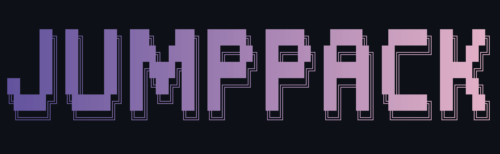

**Jumppack.nvim** is a Neovim plugin that enhances the built-in jumplist with a visual floating window picker. Navigate your jump history with preview functionality, syntax highlighting, and intuitive keymaps.

## ✨ Features

- 🎯 **Visual jumplist picker** - See all your jumps in a floating window
- 👁️ **Live preview** - Preview jump locations with syntax highlighting before jumping
- 🔄 **Smart navigation** - Intuitive keymaps that extend Vim's `<C-o>` and `<C-i>`
- 📁 **File icons** - Integration with MiniIcons and nvim-web-devicons
- ⚡ **Fast and lightweight** - Single-file plugin with minimal dependencies
- 🎨 **Fully customizable** - Configure window appearance, keymaps, and behavior
- 📍 **Enhanced position display** - Format: `[indicator] [icon] [path/name] [lnum:col]` with line previews
- 🔍 **Powerful filtering** - Filter by current file, working directory, or hide unwanted entries
- 💾 **Persistent hide system** - Mark entries as hidden and remember across sessions
- 🔀 **Multiple open modes** - Open jumps in splits, tabs, or current window

## 📼 Demo


## 📦 Installation

### [lazy.nvim](https://github.com/folke/lazy.nvim)

```lua
{
  'suliatis/jumppack',
  config = true,
}
```

### [mini.deps](https://github.com/echasnovski/mini.nvim/blob/main/readmes/mini-deps.md)

```lua
-- In your init.lua after setting up mini.deps
local add = MiniDeps.add

add({
  source = 'suliatis/jumppack',
})

require('jumppack').setup()
```

### Manual installation

Clone the repository into your Neovim packages directory:

```bash
git clone https://github.com/suliatis/jumppack.git \
  ~/.local/share/nvim/site/pack/plugins/start/jumppack
```

Then add to your init.lua:

```lua
require('jumppack').setup()
```

## 🚀 Quick Start

### Basic setup (overrides `<C-o>` and `<C-i>`)

By default, Jumppack enhances the standard jump commands with its visual picker:

```lua
-- lazy.nvim
{
  'suliatis/jumppack',
  config = true,
}

-- mini.deps
require('jumppack').setup()
```

### Keep original jump behavior

To preserve Vim's default `<C-o>`/`<C-i>` and use custom keymaps:

```lua
require('jumppack').setup({
  options = {
    global_mappings = false,  -- Preserve original <C-o>/<C-i>
  },
})

-- Custom keymaps
vim.keymap.set('n', '<leader>jo', function()
  require('jumppack').start({ direction = 'back' })
end, { desc = 'Jump back with picker' })

vim.keymap.set('n', '<leader>ji', function()
  require('jumppack').start({ direction = 'forward' })
end, { desc = 'Jump forward with picker' })
```

### Custom configuration example

```lua
local Jumppack = require('jumppack')
Jumppack.setup({
    options = {
      global_mappings = true,  -- Override <C-o>/<C-i> with Jumppack
      cwd_only = false,        -- Show all jumps or only in current directory
      wrap_edges = true,       -- Wrap around when reaching jumplist edges
    },
    mappings = {
      -- Navigation
      jump_back = '<C-o>',
      jump_forward = '<C-i>',

      -- Selection
      choose = '<CR>',
      choose_in_split = '<C-s>',
      choose_in_vsplit = '<C-v>',
      choose_in_tabpage = '<C-t>',

      -- Control
      stop = '<Esc>',
      toggle_preview = 'p',

      -- Filtering (temporary filters)
      toggle_file_filter = 'f',
      toggle_cwd_filter = 'c',
      toggle_show_hidden = '.',
      reset_filters = 'r',

      -- Hide management (persistent)
      toggle_hidden = 'x',
    },
})
```

## ⚡ Requirements

- Neovim >= 0.10.0 (for floating window API)
- Optional: [mini.icons](https://github.com/echasnovski/mini.nvim#mini.icons) or [nvim-web-devicons](https://github.com/nvim-tree/nvim-web-devicons) for file icons

## 🎮 Usage

Once installed with default settings, Jumppack automatically enhances your jumplist navigation:

1. **Navigate normally** - Use `<C-o>` to go back or `<C-i>` to go forward in your jumplist
2. **Visual picker opens** - When you have multiple jumps, a floating window shows your jump history
3. **Preview and choose** - Navigate with `<C-o>`/`<C-i>`, toggle preview with `p`, select with `<CR>`
4. **Filter and manage** - Use `f` (file filter), `c` (directory filter), `.` (show hidden), `x` (hide item)
5. **Alternative open modes** - Use `<C-s>` for split, `<C-v>` for vsplit, `<C-t>` for new tab

### Programmatic usage

After calling `setup()`, a global `Jumppack` variable is available for convenient access:

```lua
-- Open jumplist picker
Jumppack.start()

-- Jump backward with picker
Jumppack.start({ direction = 'back' })

-- Jump forward with picker
Jumppack.start({ direction = 'forward' })

-- Show only jumps in current directory
Jumppack.start({ cwd_only = true })

-- Check if picker is active
if Jumppack.is_active() then
  -- Refresh the current picker
  Jumppack.refresh()
end
```

You can also use the module directly without the global variable:

```lua
local jumppack = require('jumppack')
jumppack.start({ direction = 'back' })
```

## 🔧 Advanced Features

### Filtering System

Jumppack includes a powerful filtering system to help manage your jumplist:

- **File filter** (`f`): Show only jumps from the current file
- **Directory filter** (`c`): Show only jumps from the current working directory
- **Hidden items** (`.`): Toggle visibility of items you've marked as hidden
- **Reset filters** (`r`): Clear all active filters

### Hide System

You can mark jump entries as "hidden" to reduce clutter:

- **Hide current item** (`x`): Mark the currently selected jump as hidden
- Hidden items are remembered across Neovim sessions
- Use the show hidden filter (`.`) to view or unhide items
- Hidden items appear with a `✗` marker when visible

### Smart Display

Jumppack uses the format: **`[indicator] [icon] [path/name] [lnum:col] [│ line preview]`**

**Examples:**
- `● 󰢱 src/main.lua 45:12 │ local function init()`
- `✗  config.json 10:5 │ "name": "jumppack"`
- `↑3  init.lua 1:1 │ local M = {}`

**Display features:**
- **Smart filenames**: Ambiguous files like `init.lua` show parent directory (`parent/init.lua`)
- **Position markers**: `●` current, `↑N` back N positions, `↓N` forward N positions, `✗` hidden
- **File icons**: Integration with MiniIcons/nvim-web-devicons for file type visualization
- **Precise positioning**: Always shows line:column (`45:12`) for exact location context
- **Line previews**: See the actual content at each jump location
- **Filter status**: Shows active filters in the status line (e.g., `[File,CWD]`)

## ⚙️ Configuration

### Default configuration

```lua
require('jumppack').setup({
  options = {
    -- Override default <C-o>/<C-i> with Jumppack interface
    global_mappings = true,

    -- Only show jumps within current working directory
    cwd_only = false,

    -- Wrap around edges when navigating jumplist
    wrap_edges = true,

    -- Default view mode ('list' or 'preview')
    default_view = 'preview',
  },

  mappings = {
    -- Navigation
    jump_back = '<C-o>',        -- Navigate backward in jumplist
    jump_forward = '<C-i>',     -- Navigate forward in jumplist

    -- Selection
    choose = '<CR>',            -- Jump to selected location
    choose_in_split = '<C-s>',  -- Open in horizontal split
    choose_in_vsplit = '<C-v>', -- Open in vertical split
    choose_in_tabpage = '<C-t>', -- Open in new tab

    -- Control
    stop = '<Esc>',             -- Close picker
    toggle_preview = 'p',       -- Toggle between list and preview modes

    -- Filtering (temporary filters, reset when picker closes)
    toggle_file_filter = 'f',   -- Show only jumps in current file
    toggle_cwd_filter = 'c',    -- Show only jumps in current working directory
    toggle_show_hidden = '.',   -- Toggle visibility of hidden items
    reset_filters = 'r',        -- Clear all active filters

    -- Hide management (persistent across sessions via vim.g)
    toggle_hidden = 'x',        -- Hide/unhide current item permanently
  },

  window = {
    -- Floating window configuration
    -- Can be a table or function returning a table
    config = nil,  -- Uses sensible defaults
  },
})
```

### Window customization

```lua
require('jumppack').setup({
  window = {
    config = function()
      local height = math.floor(vim.o.lines * 0.5)
      local width = math.floor(vim.o.columns * 0.6)
      return {
        relative = 'editor',
        row = math.floor((vim.o.lines - height) / 2),
        col = math.floor((vim.o.columns - width) / 2),
        width = width,
        height = height,
        border = 'rounded',
        title = ' Jumplist ',
        title_pos = 'center',
      }
    end,
  },
})
```

## 🎨 Highlights

Jumppack uses these highlight groups (linked to defaults):

- `JumppackTitle` - Picker title (links to `FloatTitle`)
- `JumppackBorder` - Window border (links to `FloatBorder`)
- `JumppackCurrent` - Current jump indicator (links to `CursorLine`)
- `JumppackPreview` - Preview window (links to `NormalFloat`)
- `JumppackFileName` - File names (links to `Directory`)
- `JumppackLineNumber` - Line numbers (links to `Number`)

## 🧪 Development

```bash
# Clone the repository
git clone https://github.com/suliatis/Jumppack.git
cd Jumppack

# Run tests
make test              # Run in headless mode
make test-interactive  # Run with UI for debugging

# Code quality
make format  # Format with stylua
make lint    # Lint with luacheck

# Generate documentation
make doc

# Run all CI checks locally
make ci
```

## 📄 License

MIT License - see [LICENSE](LICENSE) for details.

## 🙏 Acknowledgments

- This plugin is a derivation of [mini.pick](https://github.com/echasnovski/mini.nvim#minipick) by [@echasnovski](https://github.com/echasnovski), adapted specifically for jumplist navigation
- Inspired by Vim's built-in jumplist functionality
- UI patterns and picker implementation based on mini.pick's excellent architecture
- Testing setup using [mini.test](https://github.com/echasnovski/mini.nvim#minitest)
- Documentation using [mini.doc](https://github.com/echasnovski/mini.nvim#minidoc)

---

<div align="center">
  Made with ❤️ for the Neovim community
</div>
